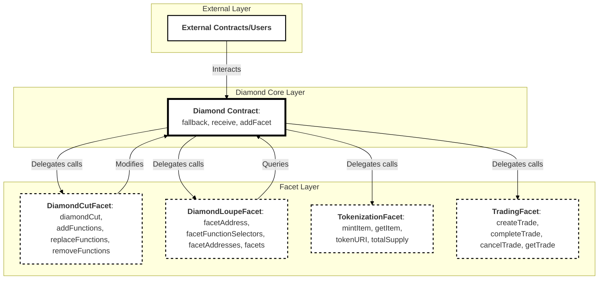

#  React + Express + Ethers.JS  -  Web3 Tokenization / Blockchain Demo
The project consists of:

### [Frontend: React ](https://github.com/ivaaak/Web3-Tokenization/tree/main/frontend)
  
### [Backend: Express + Ethers.js + Solidity + IPFS](https://github.com/ivaaak/Web3-Tokenization/tree/main/backend)

## Smart Contract Architecture / Diagram:
</img>




## Project Startup:
You can run the below commands from the main directory and start the project:

```cmd
npm i
npm start
```

This installs and starts both the FE and BE using the npm tool 'concurrently'. Or you can run the commands separately in the frontend / backend folders to have them running in separate instances/terminals.

### Built With:
-  [**✔**]  `React (Vite, Typescript)`
-  [**✔**]  `Express API`
- [**✔**]  `Ethers.js`
-  [**✔**]  `Auth0`
-  [**✔**]  `Axios`
-  [**✔**]  `MongoDB`
-  [**✔**]  `Stripe`
